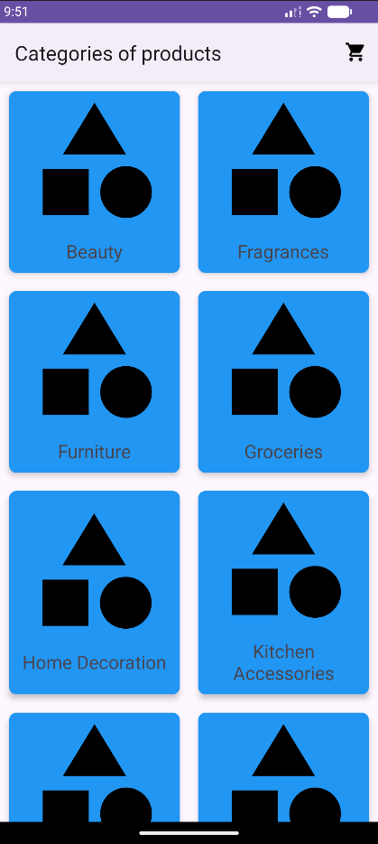
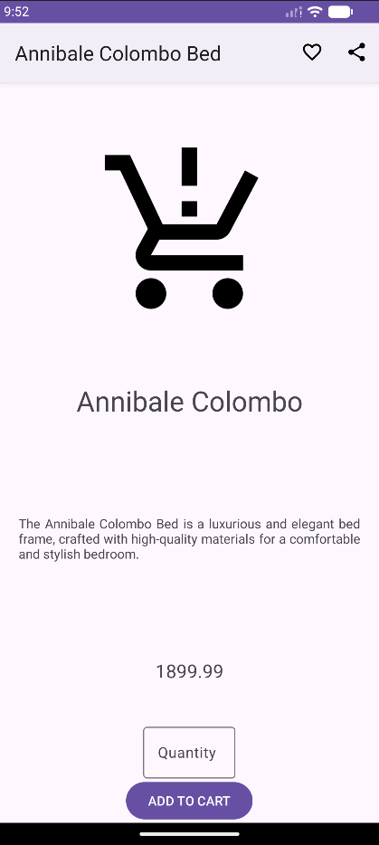
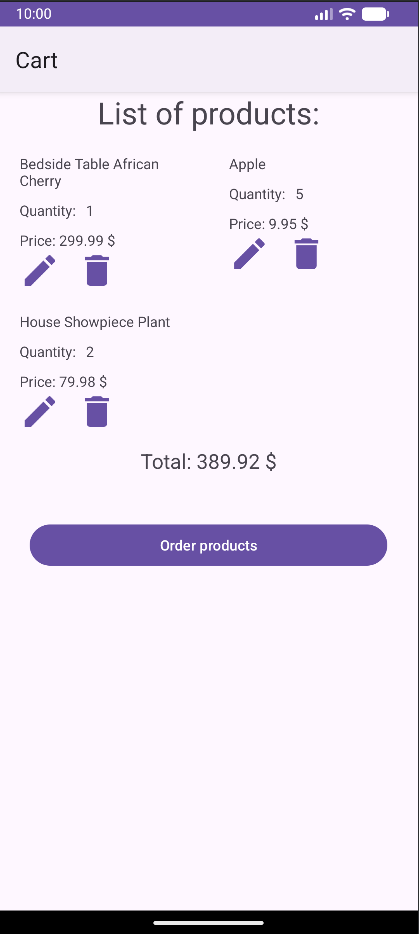

# ProductsApp - E-commerce Android Prototype

A functional e-commerce style Android app build in Kotlin. Users cn browse categories, view products, 
add to cart with quantity control, edit/delete items, mark favorites, adn see real time total price updates.

## Features
- Home screen with category list
- Product list per category + favorite filter (with toast feedback if no favorites)
- Product detail screen with add to cart button and quantity selector
- Share product URL option
- Cart screen: nested list of items, edit quantity (auto price recalculation), save delete, total display
- Action bar cart icon navigation
- Basic user feedback via toast

## Tech Stack
- **Language**: Kotlin
- **UI**: XML layouts + Views (Activity/Fragment based)
- **Architecture**: Basic separation of concepts (activities handle logic)
- **Other**: ActionBar menu, NestedScrollView, in-memory data

  This project demonstrates practical app flows like cart management (Recycle views) and dynamic pricing.

## Screenshots

    
    
    
    

## Setup
1. Clone repo
2. Open in Android Studio
3. Sync Gradle -> Run on emulator/device (min SDK 21)

## TO DO:
 Implement order products button.
 Add dialog to the app: https://medium.com/@manuchekhrdev/android-show-simple-alert-dialog-in-kotlin-f7e232ec949e
